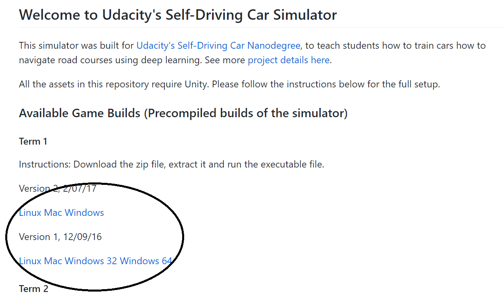
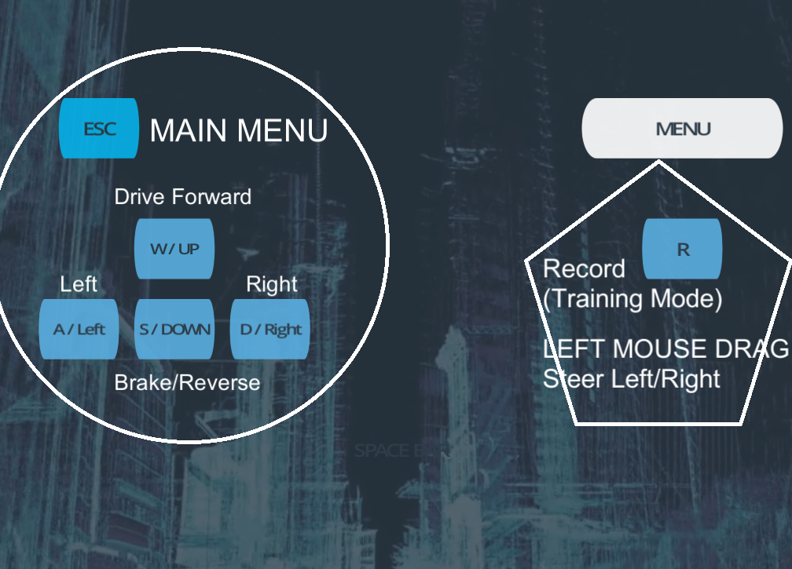

# <span style="color:blue">AI driven Vehicle Simulation using Deep Learning

##  Convolutional neural network
This repository contains code for predicting steering angles of self driving car. The inspiration is taken from Udacity Self driving car module as well End to End Learning for Self-Driving Cars module from NVIDIA

The End to End Learning for Self-Driving Cars research paper can be found at (https://github.com/aaroha33/AI-Driven-Autonomous-Vehicles/blob/main/Research_Paper.pdf) This repository is built on PyTorch library.


<font color="red">The Udacity open source self-driving car project with self enhancements.</font>

## Abstract

Data contains 3 camera(left, centre, right) output images as inputs along with steering angle as labels. Task is a supervised machine learning problem where objective is to predict steering angle based on camera inputs.

Here, I have used CNN based architecture, which comprises of 5 Convolutions layers followed by a fully connected deep neural network with 3 hidden layers for predicting steering angles. Loss function used here is Mean Squared Error.


## Prerequisites

We will use Python as the primary programming language and PyTorch as the Deep Learning framework. Other resources / software / library could be found as follows.

1. Self-driving car simulator developed by [Udacity](https://www.udacity.com/course/self-driving-car-engineer-nanodegree--nd013) with Unity. Download [here](https://github.com/udacity/self-driving-car-sim)



2. Install PyTorch environment (latest version the best) in your local machine.

3. Log in Google Colab (if you do not have GPU and would love to utilize the power of GPU, please try this and be sure to enable GPU as accelerator)


## Usage

```
git clone https://github.com/milsun/AI-Driver-CNN-DeepLearning-PyTorch.git
python3 drive.py model/model.pth  
```
Control the Car 

## Dataset

The Udacity provided dataset works well but it is not enough to get the car running in difficult terrain (like the second track in Udacity simulator). To gather the data from track 2, we would first need to create a folder in our project directory. Let’s call this folder "data". Now, start the simulator. Select the second track from the menu and go to the training mode option.


Click "RECORD" button on the right corner and select a directory as the folder to save your training image and driving log information.


Click "RECORD" again and move your car slowly and carefully. After you have completed recording your move, the training data will be stored in the folder you selected. Here I suggest you record at least 3 laps of the race. Please try best to stay at the center of the road. Also, record laps in reverse direction as it will give more data and thus would help avoid overfitting.

### Data


|         Left        |         Center        |         Right        |
|:-------------------:|:---------------------:|:--------------------:|
|  |  |  |


* /IMG/ - recorded images from cneter, left and right cameras.
* driving_log.csv - saved the image information and associated information like steer angle, current speed, throttle and brake.

## Training Network

Below fig shows architecture used in the project.


## Results

### Training loss vs Validation loss

<div align="center">
  
  <p>Training loss vs Validation loss (generalized)</p>
</div>

## Demo
[](https://www.youtube.com/watch?v=7VmIJRY-JtY) 
